# Orchestrator

Run and supervise AI coding agents from your desktop and your phone. A native Windows app built with Go and React ([Wails](https://wails.io/)), plus an installable iOS home-screen app that connects back to your PC.

## Desktop

| | |
|---|---|
| 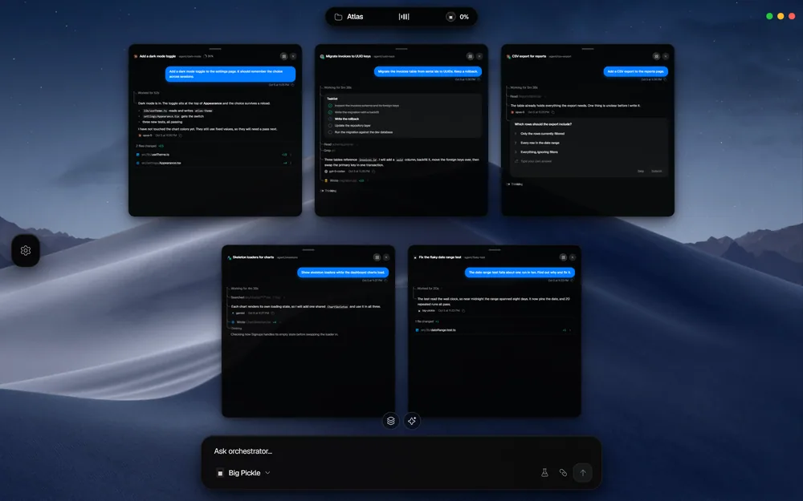 | 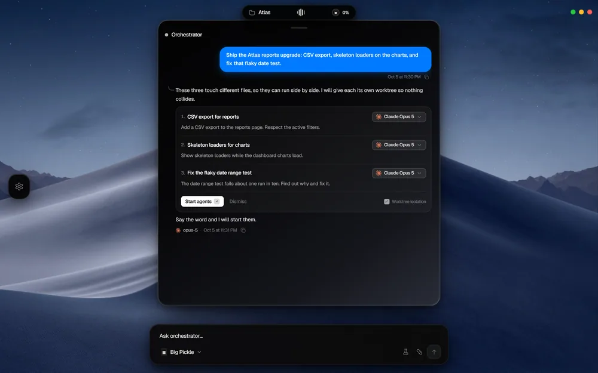 |
| 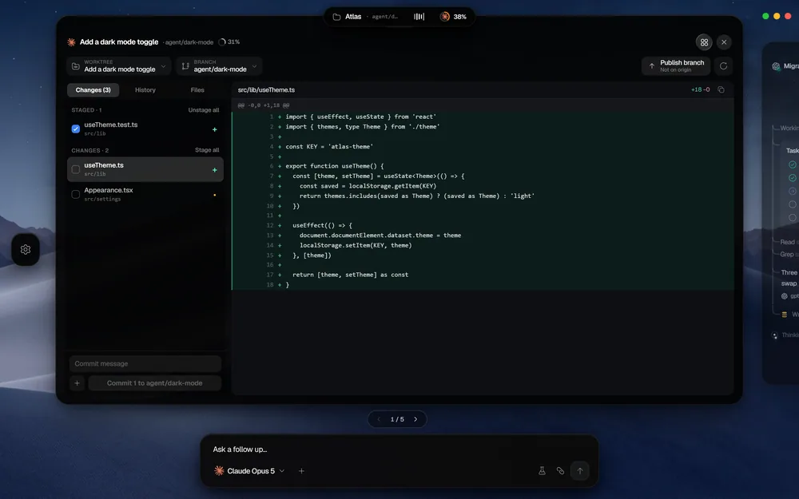 | 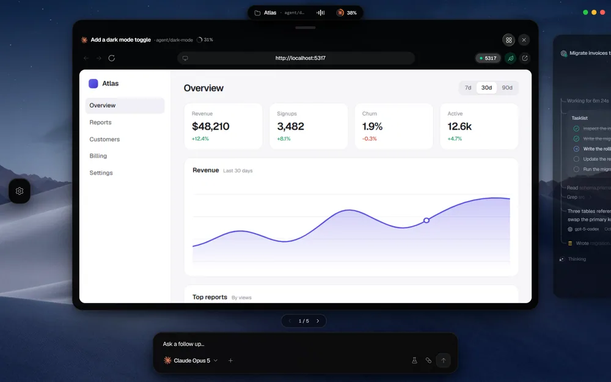 |
| 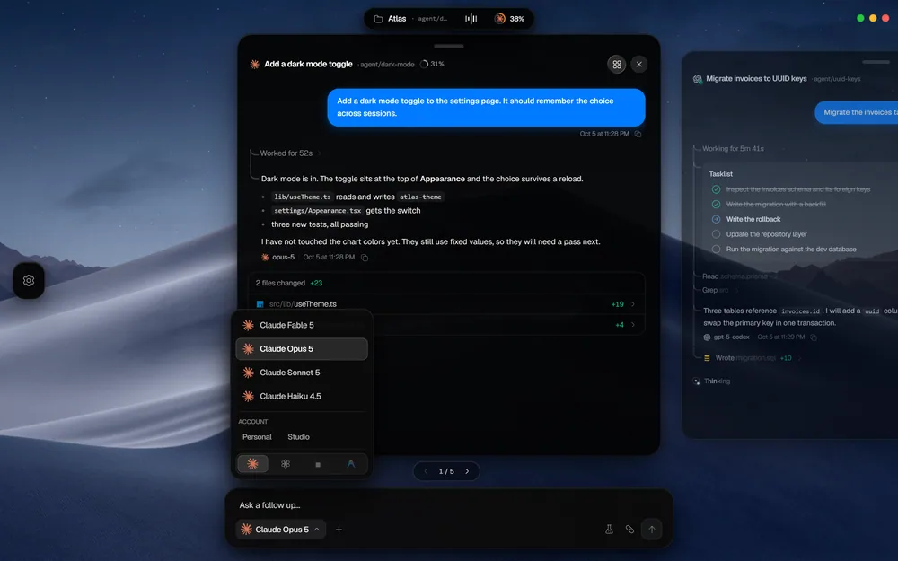 | 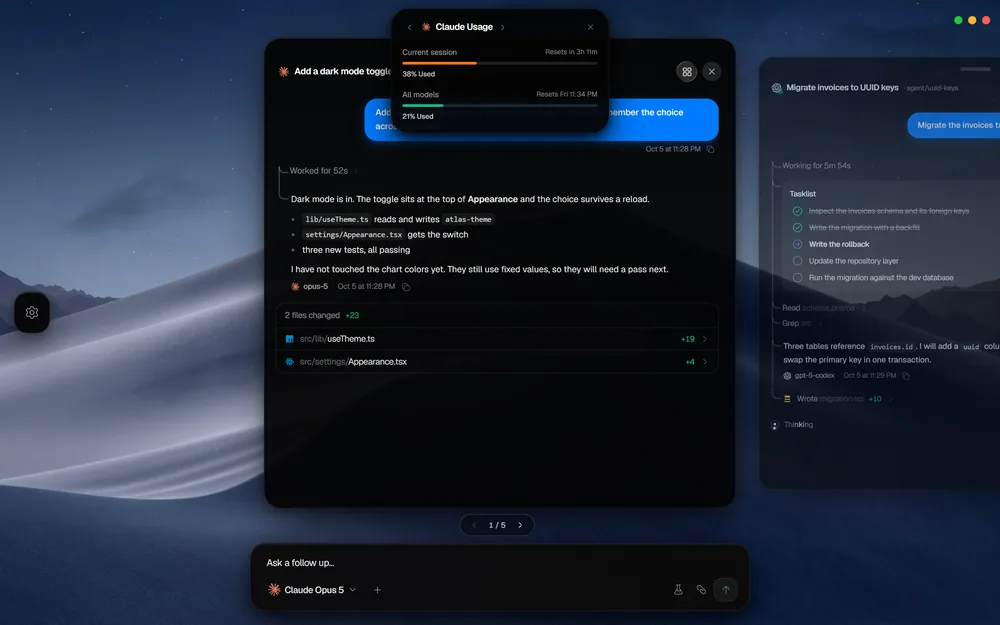 |
| 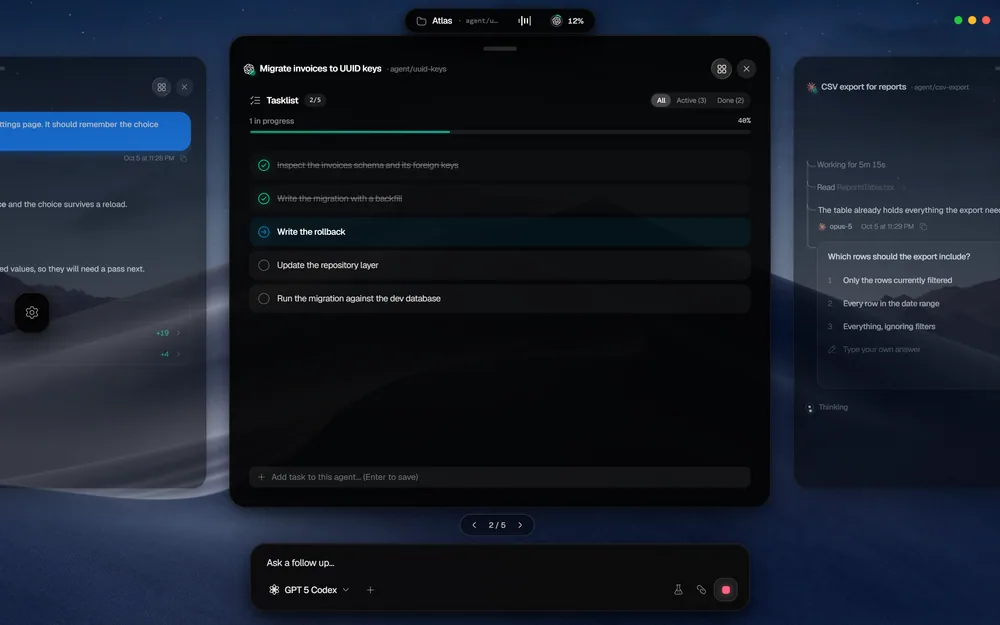 | 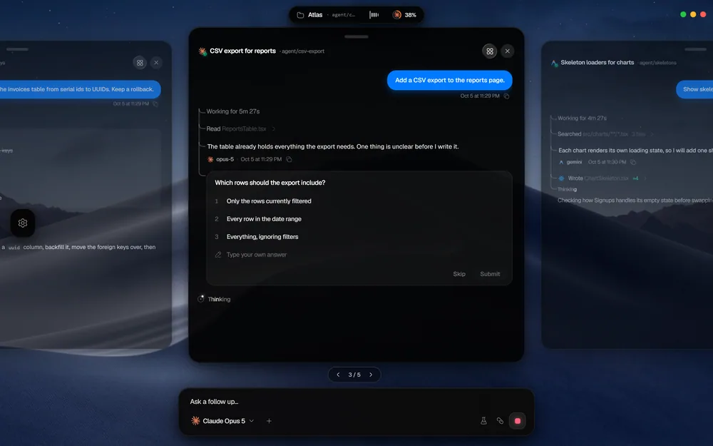 |

## Phone

  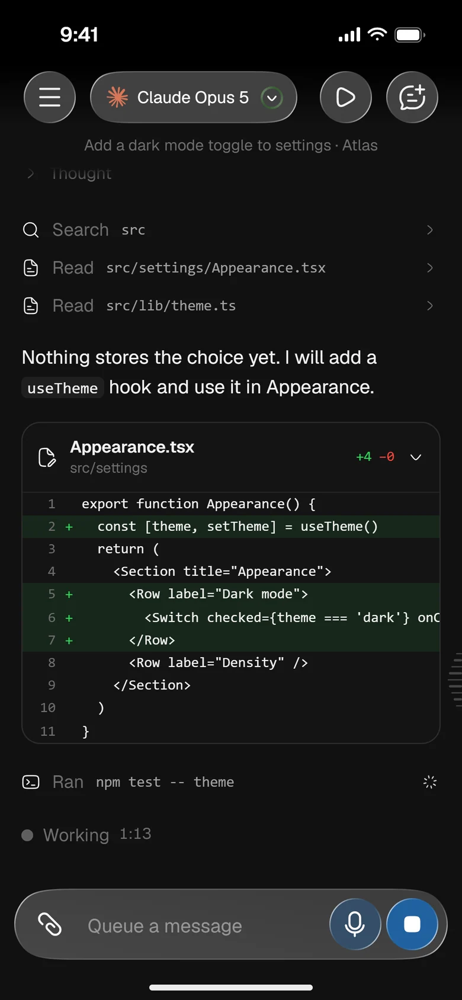
  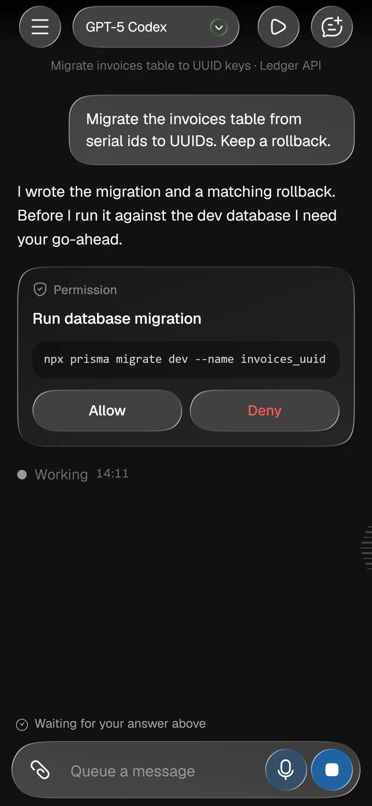
  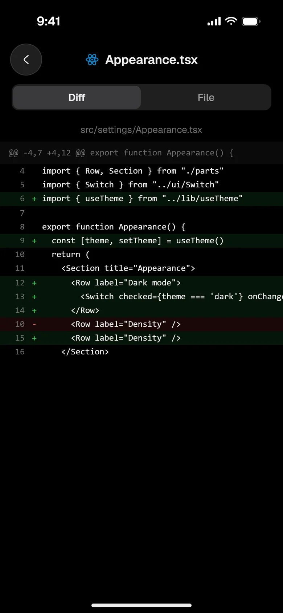
  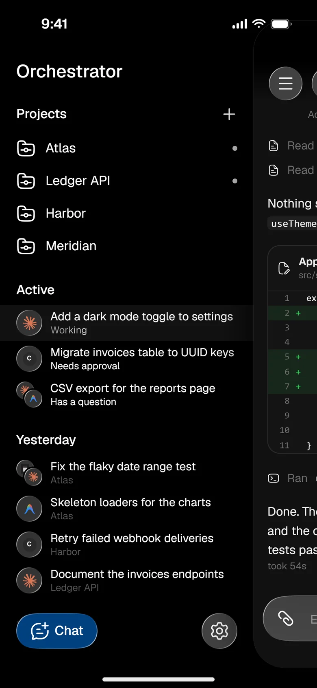

  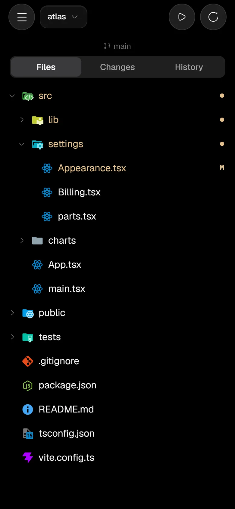
  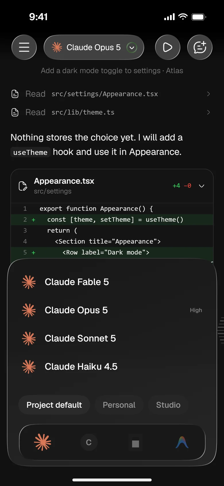
  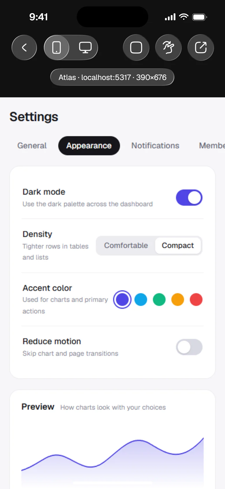
  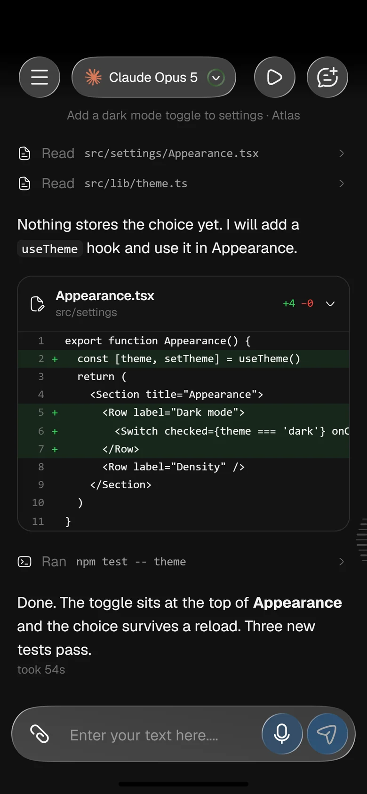

## Layout

- `desktop/`: the Wails app (Go entry point, React frontend in `desktop/frontend`, build assets)
- `internal/`: Go packages shared by the desktop app and the phone server
- `internal/remote/mobile/`: the phone app (React + Vite), embedded into the desktop binary at build time
- `cmd/`: developer tools
- `scripts/`: Windows install and update scripts
- `tools/`: Vite plugins shared by both UIs
- `website/`: landing page

## Development

Run from `desktop/`:

- Live development: `wails dev`
- Production build: `wails build` (also builds the phone app, which is not committed)
- Update the installed exe: `scripts/update-exe.ps1`

Phone app on its own: `cd internal/remote/mobile && npm install && npm run dev`.
