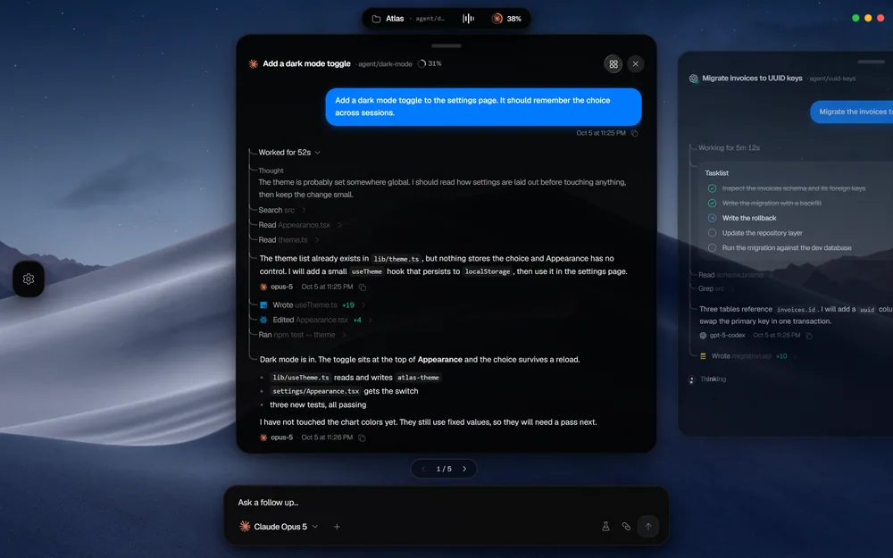

# Orchestrator

Run and supervise AI coding agents from your desktop and your phone. Orchestrator is a native Windows app built with Go and React ([Wails](https://wails.io/)), plus an installable iOS home-screen app that connects back to your PC.


## Features

- **Many agents, one place.** Run Claude Code, Codex, OpenCode and Antigravity side by side.
- **Per-task models and worktrees.** Pick a model for each task and start every agent in its own git worktree so they never step on each other.
- **Any model, any account.** Switch providers mid-chat and keep an eye on every quota.
- **Review before it lands.** Stage, commit and publish from the agent's own worktree.
- **Watch it run.** Dev servers open in a live preview right inside the agent's card.
- **Your look.** Dark, light or glass themes, with wallpapers of your choice.

## Desktop

### Deck and grid

The deck is the home screen: every running agent is a card you can flip through with `Ctrl` + arrow keys. `Ctrl` + `Space` lays all agents out in a grid so you can see everything at once.

| Deck | Grid |
|---|---|
|  |  |

### Plans, questions and tasks

Agents can lay out a plan before they start, ask you questions when they need a decision, and keep a task list you can follow as work progresses.

| Plan | Question | Tasks |
|---|---|---|
|  |  |  |

### Git and live preview

Review an agent's changes, then stage, commit and publish straight from its worktree. Dev servers started by an agent open in a built-in preview so you can see the result without leaving the app.

| Git | Preview |
|---|---|
|  |  |

### Models and usage

Choose a model per chat, switch providers mid-conversation, and track usage and quota across all your accounts.

| Models | Usage |
|---|---|
|  |  |

## Phone

The phone app is a home-screen web app served by the desktop app over your network. Open **Settings → Phone access** on the desktop and scan the code with your phone to sign in. From there you can follow chats live, approve or deny agent actions, read diffs, browse files, switch models and open the preview, all while away from your desk.

<p>
  
  
  
  
</p>

| Screen | What it does |
|---|---|
| Live chat | Follow an agent as it works and send it new instructions |
| Approvals | Allow or deny tool calls and answer agent questions |
| Diff | Review the changes an agent made |
| Files | Browse the project's files |
| Models | Change the model or provider for a chat |
| Preview | Open a running dev server on your phone |

## Layout

- `desktop/`: the Wails app (Go entry point, React frontend in `desktop/frontend`, build assets)
- `internal/`: Go packages shared by the desktop app and the phone server
- `internal/remote/mobile/`: the phone app (React + Vite), embedded into the desktop binary at build time
- `cmd/`: developer tools
- `scripts/`: Windows install and update scripts
- `tools/`: Vite plugins shared by both UIs
- `website/`: landing page

## Setup locally

### Prerequisites

- Windows 10 or 11
- [Go](https://go.dev/dl/) 1.25 or newer
- [Node.js](https://nodejs.org/) 22 or newer (includes npm)
- [Wails CLI v2](https://wails.io/docs/gettingstarted/installation): `go install github.com/wailsapp/wails/v2/cmd/wails@latest`
- At least one agent CLI installed and signed in (for example Claude Code or Codex)

Run `wails doctor` to confirm your toolchain is ready.

### Run in development

```powershell
git clone https://github.com/lirikrexhepi/Catalyst.git
cd Catalyst/desktop
wails dev
```

This starts the desktop app with live reload for the Go backend and the React frontend.

### Build

From `desktop/`:

```powershell
wails build
```

The executable is written to `desktop/build/bin/orchestrator.exe`. The build also compiles the phone app, which is embedded into the binary and not committed.

To replace the installed exe with a fresh build, run `scripts/update-exe.ps1` from the repo root.

### Phone app on its own

```powershell
cd internal/remote/mobile
npm install
npm run dev
```

### Checks

```powershell
go vet ./...
go test ./...
```
